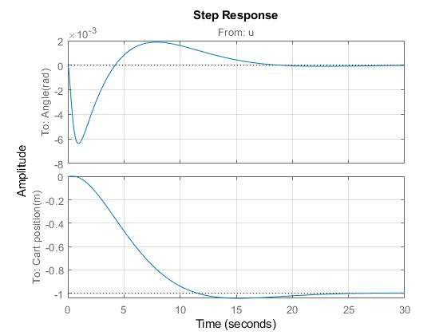

------------------------------------------------------------------------

------------------------------------------------------------------------

\
**Projeto Final\
Controle LQR de um pêndulo invertido**\
*ES728 - Controle Avançado de Sistemas*\

------------------------------------------------------------------------

------------------------------------------------------------------------

\
\
\
\

Projeto
=======

Primeira parte(vetor de estado conhecido)
-----------------------------------------

1.  **Projetar um controlador LQR para o controle do pêndulo invertido,
    usando o mesmo modelo apresentado na seção "IV --Design of LQR"do
    artigo anexo.**

2.  **Repetir as simulações das figuras 2,3,4,5 desse artigo.**

Para a obtenção do controlador LQR, iremos utilizar a ferramenta Matlab.
E para isso precisamos definir as matriz A, B, C e D como informadas no
enunciado. Portanto:\
A = $\begin{pmatrix} 
0 & 1 & 0 & 0 \\ 16.0976 & 0 & 0 & 0 \\ 0 & 0 & 0 & 1 \\ -0.73177 & 0 & 0 & 0\\
\end{pmatrix}$ B = $\begin{pmatrix}
0 \\ -0.1463 \\ 0 \\ 0.0976\\
\end{pmatrix}$\
C = $\begin{pmatrix}
1 & 0 & 0 & 0 \\ 0 & 0 & 1 & 0\\
\end{pmatrix}$ D = $\begin{pmatrix}
0
\end{pmatrix}$\
Como queremos encontrar apenas os valores de ganho para as saídas
conhecidas e com o mesmo peso em relação ao controle, iremos assumir:\
$Q = C^{T}*C$\
Q = $\begin{pmatrix}
     1 & 0 & 0 &  0\\
     0 & 0 & 0 & 0\\
     0 & 0 & 1 & 0\\
     0 & 0 & 0 & 0\\
\end{pmatrix}$ R = 1\
Depois disso podemos utilizar o comando *care* do matlab então: =
care(A,B,Q,R)\
P = $1*10^{3}$$\begin{pmatrix}
     7.4681 & 1.8743 & 0.0612 &  0.3019\\
     1.8743 & 0.4705 & 0.0158 & 0.0780\\
     0.0612 & 0.0158 & 0.0052 & 0.0135\\
     0.3019 & 0.0780 & 0.0135 & 0.0637\\
\end{pmatrix}$ L = $\begin{pmatrix}
     -4.0122 + 0.0183i\\
     -4.0122 - 0.0183i\\
     -0.2133 + 0.2132i\\
     -0.2133 - 0.2132i\\
\end{pmatrix}$ K = $\begin{pmatrix}
     -244.7533 & -61.2266 & -1.00 & - 5.1889\\
\end{pmatrix}$ Com isso conseguimos encontrar os valores dos autovalores
e dos ganhos para o controlador em malha fechada.Porém dessa maneira
também conseguimos obter diretamente os valores do ganho L do
observador. Outra maneira de obtermos os valores do ganho K do
controlador é através do comando direto *lqr*, dessa maneira, teremos:\
K = lqr(A,B,Q,R)\
Com os valores dos ganhos, definimos os estados, sendo Ac em malha
fechada e encontramos os gráficos solicitados de resposta ao impulso,
resposta ao impulso com condições iniciais diferentes de zero e
finalmente resposta ao impulso com presença de distúrbio, logo:\
Ac = \[(A-B\*K)\]\
Bc = \[B\]\
Cc = \[C\]\
Dc = \[D\]\
sys = ss(Ac,Bc,Cc,Dc)\
Ac = $\begin{pmatrix}
     0 & 1.00 & 0 &  0\\
     -19.7098 & -8.9574 & -0.1463 & -0.7591\\
     0 & 0 & 0 & 1.0\\
     23.1562 & 5.9757 & 0.0.976 & 0.5064\\
\end{pmatrix}$

**O "método" deve ser utilizado para que potência e torque máximos
declarados pela Honda (motor R20Z1), Audi (motor A4 1.8) ou pela Porsche
(968) (ou por qualquer outro fabricante, para qualquer modelo de motor),
sejam estimados com a melhor precisão possível. Parâmetros geométricos
do motor são apresentados na Tabela 1, bem como seus resultados
operacionais. Os resultados conhecidos são para operação com gasolina
pura.**

           Parâmetro              Honda R20Z1       Audi A4 1.8       Porsche 968     Unidade
  ---------------------------- ----------------- ----------------- ----------------- ---------
      Número de cilindros              4                 4                 4            ---
   \# de tempos (de operação)          4                 4                 4            ---
     Cilindrada (declarada)          2.000             1.800             2.990          cm3
       Taxa de compressão           11,1:1            10,3:1            11,0:1          ---
       Curso dos pistões             96,9              86,4              88,0           mm
      Diâmetro dos pistões           81,0              81,0              104,0          mm
        Potência máxima         155 @ 6.000 rpm   123 @ 5.800 rpm   237 @ 6.200 rpm     HP
         Torque máximo          190 @ 4.500 rpm   173 @ 3.950 rpm   306 @ 4.100 rpm     N.m
       Velocidade máxima              190               202               253          km/h

  : Parâmetros conhecidos dos dois motores (e dos veículos) e resultados
  para operação a plena carga

**1 - Para o motor escolhido, ajuste o procedimento para que os
resultados de potência efetiva e torque máximos sejam adequados em
relação aos parâmetros de desempenho divulgados pelos fabricante.**

**2 - Compare a temperatura máxima operacional do ciclo nos dois pontos
em que o modelo foi ajustado (i.e. para a reproduzir potência efetiva e
torque máximos).**

**3 - Compare os parâmetros operacionais listados a seguir para os dois
pontos em que o modelo foi ajustado (potência e torque máximos):
rendimento mecânico, rendimento volumétrico, rendimento indicado,
rendimento térmico e CEC.**

**4 - Qual o efeito das condições ambiente (temperatura e pressão
atmosférica) (i.e. varie no modelo ambos parâmetros) sobre os seguintes
parâmetros de desempenho: potência efetiva, torque, rendimento térmico e
CEC?**

**5 - O procedimento disponível permite a análise do impacto do
combustível usado. O ajuste disponível é para a consideração de operação
com gasolina pura (do ponto de vista químico, é suposto octano). Qual o
impacto da operação com etanol puro?\
Simplificadamente, suponha que os parâmetros para etanol são os mesmos
da operação com gasolina, e compare os resultados dos parâmetros a
seguir: potência efetiva, torque, rendimento térmico, CEC e fluxo de
combustível. Em um motor flex-fuel, quais parâmetros são ajustados
quando a operação passa de etanol para gasolina, e vice versa? Nesses
motores, no Brasil, qual dispositivo permite a identificação do
combustível em uso?**

**6 - Qual o impacto do parâmetro "ALFA" (célula c17 na planilha) sobre
os seguintes resultados de desempenho: potência efetiva, torque,
rendimento térmico e CEC? Há uma situação em que o motor tem maior
potência, e uma em que é mais eficiente? Caso a resposta seja
afirmativa, em que condição o motor deve operar em trânsito normal?
Diz-se que quando o motor é instantaneamente acelerado, o condutor quer
ter maior torque. Assim, como é feito o controle para que o motor tenha
resposta imediata, quando é acelerado?**

**7 - Observe o estado termodinâmico dos gases no fim do processo de
expansão. O que sugere esse estado termodinâmico? É possível aproveitar
a energia associada? Como?**

**8 - Na regulação Europeia, os veículos leves devem emitir menos de 180
gCO2/km rodado, e essas emissões deverão estar abaixo de 120-130 gCO2/km
rodado em poucos anos. A partir dos resultados do procedimento
disponível, qual a estimativa de emissões de CO2 (em gCO2/km) quando da
operação do veículo em velocidade máxima, com gasolina pura?**

Obtendo valores mais próximos aos do fornecedor
-----------------------------------------------

Escolhendo o motor do Audi A4 1.8, portanto utilizando os parâmetros
fornecidos na Tabela 1 e variando os valores na planilha excel
fornecida, conseguimos obter valores mais próximos aos fornecidos pelas
montadoras. Logo teremos:

           Parâmetro            Audi A4 1.8   Valor obtido    Erro     Unidade
  ---------------------------- ------------- -------------- --------- ----------
     Cilindrada (declarada)        1.800          1781       -1.06 %   $cm^{3}$
   Potência efetiva (Arques)        123          123.97      0.79 %       HP
    Potência efetiva (ABNT)         123          118,12      -3.97 %      HP
   Potência efetiva (Khovakh)       123          113.75      -7,52 %      HP
     Torque correspondente         151.5         150.02      -0.98 %     N.m

  : Parâmetros ajustados para obtenção da potência efetiva para o motor
  em plena carga

Portanto vemos que o método de Arques obtém os valores mais aproximados
em relação a potência efetiva. Para obtermos o valor de torque máximo
indicado, utilizamos os valores de torque máximo = 173N.m, rotação =
3950 rpm e potência = 72.5kW, valores obtidos na primeira referência
indicada no final do trabalho, ajustando os valores da tabela novamente
encontramos:

           Parâmetro            Audi A4 1.8   Valor obtido    Erro     Unidade
  ---------------------------- ------------- -------------- --------- ----------
     Cilindrada (declarada)        1.800          1781       -1.06 %   $cm^{3}$
   Potência efetiva (Arques)       97.1          96.99       -0.11 %      HP
    Potência efetiva (ABNT)        97.1          92.21       -5.04 %      HP
   Potência efetiva (Khovakh)      97.1          91.09       -6.19 %      HP
         Torque máximo              173          172.36      -0.37 %     N.m

  : Parâmetros ajustados para a obtenção do torque máximo com o motor em
  plena carga

Nesse caso vemos que o método de Arques continua a indicar um menor
desvio para a potência efetiva. E observamos que conforme era esperado
para a obtenção de um torque máximo adequado é necessário uma rotação
diferente da fornecida para uma potência máxima, assim como pode ser
observado em curvas características de torque x rotação.

Temperatura máxima
------------------

Comparando a temperatura máxima operacional para a situação de potência
máxima e para a situação de torque máximo, teremos:

                                Valor obtido
  ---------------------------- --------------
      Temperatura admissão        321.76 K
       Temperatura máxima        2639.65 K
   Potência efetiva (Arques)     123.97 HP
    Potência efetiva (ABNT)      118.12 HP
   Potência efetiva (Khovakh)    113.75 HP

  : Para potência efetiva máxima

                                Valor obtido
  ---------------------------- --------------
      Temperatura admissão        320.58 K
       Temperatura máxima        2630.42 K
   Potência efetiva (Arques)      96.99 HP
    Potência efetiva (ABNT)       92.21 HP
   Potência efetiva (Khovakh)     91.09 HP

  : Para torque máximo

Apesar da diferença de alguns parâmetros para obtermos potência máxima e
torque máximo, ambos irão ocorrer quase a mesma temperatura na admissão,
porém observamos que há uma diferença de aproximadamente 9 graus na
temperatura máxima (T3), aumentando a potência fornecida.

Parâmetros adicionais
---------------------

Observando os parâmetros adicionais teremos para a situação de potência
efetiva máxima e de torque máximo a seguinte variação em relação ao
modelo inicial.

                            Valor (Pot. max.)   Valor ( Torq. max.)    Desvio
  ------------------------ ------------------- --------------------- ----------
     Temperatura máxima         2639.65 K            2630.42 K        -0.35 %
    Rendimento mecânico          82.7 %               88.9 %           6.97 %
   Rendimento volumêtrico        90.9 %               92.8 %           2.05 %
    Rendimento indicado          36.3 %                38 %            4.47 %
     Rendimento térmico          27.3 %               31.4 %          13.06 %
            CEC               303.2 g\*kW/h        263.7 g\*kW/h      -14.98 %
    Consumo combustível         7.67 g/s             5.22 g/s         -46.93 %

  : Variação dos parâmetros adicionais

Assim como nos itens anteriores iremos utilizar os valores fornecidos
pela montadora como valores de referência. Sabendo disso, e analisando
os dados obtidos verificamos que para a situação de potência máxima
obtemos valores bem próximos aos de referência. Diferente da situação
para o torque máximo, uma vez que a rotação utilizada não será a máxima,
diferente do que ocorre para a potência máxima. Com isso os parâmetros
relacionados a rendimento e consumo de combustível será visivelmente
afetados pela rotação utilizada.

Efeito das condições ambientes
------------------------------

Para definirmos a influência das condições ambientes iremos variar
individualmente a temperatura e a pressão mantendo os outros fatores com
os mesmos valores que foram utilizados nos exercícios anteriores.

Variando a Temperatura:

                                Temperatura 25ºC   Temperatura 30ºC    Desvio
  ---------------------------- ------------------ ------------------ ----------
      Temperatura admissão          321.76 K           326.93 K       \- 1.58%
   Potência efetiva (Arques)       123.97 HP           121.3 HP       -2.20 %
    Potência efetiva (ABNT)        118.12 HP          114.46 HP       -3.20 %
   Potência efetiva (Khovakh)      113.75 HP          111.09 HP       -2.39 %
             Torque                150.02 Nm          146.80 Nm       -2.19 %
       Rendimento térmico            27.3 %             27.1 %        -0.74 %
              CEC                303.2 g\*kW/h      304.9 g\*kW/h      0.56 %
     Consumo de combustível         7.67 g/s           7.55 g/s       -1.59 %

  : Variação dos parâmetros em relação ao aumento da temperatura de
  admissão.

De maneira semelhante para a pressão, teremos:

                                Pressão ambiente (1.013 bar)   Pressão ambiente (1.020 bar)   Desvio
  ---------------------------- ------------------------------ ------------------------------ ---------
      Temperatura admissão                321.76 K                       321.76 K               --
   Potência efetiva (Arques)             123.97 HP                      125.00 HP             0.82 %
    Potência efetiva (ABNT)              118.12 HP                      119.16 HP             0.87 %
   Potência efetiva (Khovakh)            113.75 HP                      114.79 HP             0.91 %
             Torque                      150.02 Nm                      151.28 Nm             0.83 %
       Rendimento térmico                  27.3 %                         27.3 %               -- %
              CEC                      303.2 g\*kW/h                  302.7 g\*kW/h           -0.17 %
     Consumo de combustível               7.67 g/s                       7.73 g/s             0.78 %

  : Variação dos parâmetros em relação ao aumento da pressão ambiente.

Com isso conseguimos observar que o aumento da temperatura ambiente
diminui o rendimento e a performance do motor, enquanto o aumento da
pressão ambiente promove um aumento, isso se deve pelo fato da densidade
do ar afetar diretamente a potência efetiva.

Variando o combustível
----------------------

Para verificarmos a influência do combustível utilizado iremos comparar
os parâmetros já utilizados anteriormente, porém dessa vez alterando
apenas o combustível utilizado, considerando ambos como misturas puras.

                                                Gasolina          Etanol        Desvio
  ------------------------------------------ --------------- ---------------- ----------
             Temperatura admissão               321.76 K         321.76 K       0.00 %
          Potência efetiva (Arques)             123.97 HP       140.85 HP      11.98 %
           Potência efetiva (ABNT)              118.12 HP       130.63 HP      12.50 %
          Potência efetiva (Khovakh)            113.75 HP       130.63 HP      12.92 %
                    Torque                      150.02 Nm       170.46 Nm      11.99 %
              Rendimento térmico                 27.3 %            30 %         9.00 %
                     CEC                      303.2 g\*kW/h   424.00 g\*kW/h   28.49 %
            Consumo de combustível              7.67 g/s        12.19 g/s      37.08 %
   Trabalho produzido por kg de combustível      15.8 kJ         11.1 kJ       -42.34 %

  : Variação dos parâmetros em relação a diferentes combustíveis.

Comparando o mesmo motor utilizando combustíveis diferentes e sabendo
que os poderes caloríficos tanto da gasolina, 43.54 MJ/Kg, e o do
álcool, 28.26 MJ/Kg. Encontramos que para a produção da mesma quantidade
de potência seria necessário uma quantidade maior de álcool, e com isso
os parâmetros como rendimento térmico, consumo de combustível, CEC são
prejudicados. Atualmente os carros possuem modernos sistemas eletrônicos
capazes de identificar rapidamente o combustível utilizado no veículo,
permitindo a existência de motores flex. A maneira que essa
identificação ocorre é através da medição da quantidade de oxigênio
presente nos gases residuais que saem do motor, para isso se utiliza uma
sonda medidora de oxigênio conhecida como sonda Lambda posicionada no
escapamento. Uma vez que a gasolina e o etanol equações de combustão
diferentes permite essa identificação de maneira rápida. Assim que o
combustível é identificado o sistema de controle passa a ajustar a
injeção eletrônica e os demais parâmetros de combustão de maneira a
otimizar o desempenho conforme o combustível utilizado.

Alterando o parâmetro Alfa
--------------------------

O parâmetro Alfa tem relação direta com a mistura ar-combustível que é
injetada diretamente na câmara de combustão, dessa maneira possui
impacto direto sobre a eficiência do motor. Assim, assumindo Alfa = 0.9
como o valor de referência, variando então Alfa teremos:

                                               Alfa = 0.8      Alfa = 0.9       Alfa = 1
  ------------------------------------------ --------------- --------------- ---------------
             Temperatura admissão               321.76 K        321.76 K        321.76 K
          Potência efetiva (Arques)             105.63 HP       123.97 HP       142.42 HP
           Potência efetiva (ABNT)              99.79 HP        118.12 HP       136.58 HP
          Potência efetiva (Khovakh)            95.42 HP        113.75 HP       132.21 HP
                    Torque                      127.84 Nm       150.02 Nm       172.36 Nm
              Rendimento térmico                 20.7 %          27.3 %          34.7 %
                     CEC                      399.3 g\*kW/h   303.2 g\*kW/h   237.9 g\*kW/h
            Consumo de combustível              8.61 g/s        7.67 g/s        6.92 g/s
   Trabalho produzido por kg de combustível      12.3 kJ         15.8 kJ         19.7 kJ

  : Variação da relação ar-combustível representada por Alfa.

Assim conforme era o esperado, variando os valores de Alfa e Beta,
concluímos que quanto maior os valores de ambos maior será o rendimento
e consequentemente os outros parâmetros de desempenho além de um menor
consumo de combustível para a produção da mesma potência. Porém quanto
maior o valor de Alfa, maior será a temperatura máxima dentro da câmara
de combustão, de maneira que caso não seja ajustada corretamente pode
ultrapassar o valor de segurança do material.

Sabendo disso e utilizando modernos sistemas de controle podemos variar
o valor de Alfa conforme a necessidade, em situações que são solicitadas
maiores torques o valor de alfa é aumentado, e em situações de trânsito
normal teremos um valor de alfa menor com o objetivo de preservar os
componentes do motor e otimizar o rendimento. O sistema de controle que
permite esse ajuste de parâmetro está relacionado com a sonda Lambda
presente no escapamento e atua diretamente na injeção da mistura
ar-combustível pelo sistema de injeção eletrônica.

Reaproveitando dos gases
------------------------

No fim do processo de expansão os gases residuais são eliminados a altas
pressões e temperaturas e portanto é possível utiliza-lós em sistemas
turbocompressores utilizando esses gases para movimentar uma turbina e
aumentar a quantidade de gás na admissão do motor, melhorando assim a
eficiência volumétrica e o rendimento.

Estimativa de $CO_{2}$ em velocidade máxima
-------------------------------------------

Sabendo que a equação de combustão completa já balanceada para a
gasolina será da forma:
$$C_{8}H_{18} + 12.5O_{2} + 47N_{2} = 8CO_{2} + 9H_{2}O + 47N_{2}$$

Pela definição teremos que as massas molares do $C_{8}H_{18}$ = 114.23
g/mol e do $CO_{2}$ = 44 g/mol. Assim pela equação de combustão temos
que para cada 1 mol de $C_{8}H_{18}$ teremos a formação de 8 mols de
$CO_{2}$. Além disso sabendo que para a rotação máxima de 5800 rpm o
fluxo mássico de combustível será de 7.68 g/s, teremos então para essa
situação a formação de 0.536 mol, ou seja, 23.584 g/s de $CO_{2}$.
Sabendo que a velocidade máxima do Audi A4 1.8 será de 202 km/h. Dessa
maneira teremos a produção de:\
$$emissaoCO_{2} = \frac{m_{CO_{2}}*60*60}{202} = \frac{23.584*3600}{202}  = 420.3  \frac{gCO_{2}}{km}$$

Bibliografia
============

-   MICHAEL J. MORAN; HOWARD N. SHAPIRO; DAISIE D. BOETTNER; MARGARET B.
    BAILEY; Princípios de Termodinâmica para Engenharia. Sétima edição.

-   Informações técnicas do motor Audi A4 1.8 utilizado. Disponível em:
    https://www.ultimatespecs.com/car-specs/Audi/3833/Audi-A4-(B5)-18-Quattro.html
